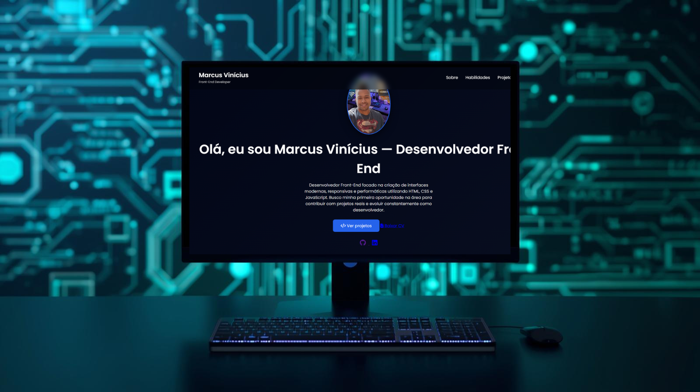

# 💻 Portfólio | Marcus Vinícius

Bem-vindo ao meu portfólio de desenvolvimento Front-End.

Este projeto foi criado com o objetivo de apresentar minhas habilidades, projetos práticos e evolução na área de desenvolvimento web.

O site reúne aplicações desenvolvidas utilizando HTML, CSS e JavaScript, com foco em criação de interfaces modernas, responsivas e com boa experiência para o usuário.

---

## 🚀 Sobre o Projeto

Este portfólio foi desenvolvido para centralizar meus projetos e demonstrar minhas habilidades como desenvolvedor Front-End em transição de carreira para a área de tecnologia.

O site apresenta:

- Informações profissionais
- Tecnologias que utilizo
- Projetos desenvolvidos
- Links para código no GitHub
- Links para projetos publicados

Além disso, o portfólio possui animações, layout responsivo e design moderno.

---

## 🛠 Tecnologias utilizadas

As principais tecnologias utilizadas neste projeto foram:

- **HTML5** – Estruturação semântica da aplicação
- **CSS3** – Estilização, layout responsivo e animações
- **JavaScript (ES6+)** – Interatividade e manipulação do DOM
- **Git** – Controle de versão
- **GitHub** – Armazenamento e publicação dos projetos

---

## 📂 Projetos apresentados no portfólio

Alguns projetos que fazem parte do portfólio:

### 🎲 Sorteador de Números
Aplicação web que gera números aleatórios dentro de um intervalo definido pelo usuário.

Tecnologias utilizadas:
- HTML
- CSS
- JavaScript

---

### 💱 Conversor de Moedas
Aplicação que realiza conversão de moedas com atualização dinâmica dos valores.

Tecnologias utilizadas:
- HTML
- CSS
- JavaScript

---

### ✊✋✌ Jogo Jokenpô
Jogo interativo de Pedra, Papel e Tesoura desenvolvido com JavaScript.

Tecnologias utilizadas:
- HTML
- CSS
- JavaScript

---

### ✅ Gerenciador de Tarefas
Aplicação web para gerenciamento de tarefas, permitindo adicionar, editar e remover atividades.

Tecnologias utilizadas:
- HTML
- CSS
- JavaScript

---

### 🧠 Quiz Interativo
Aplicação de perguntas e respostas com sistema de pontuação e atualização dinâmica da interface.

Tecnologias utilizadas:
- HTML
- CSS
- JavaScript

---

### 🔐 Gerador de Senhas
Aplicação para geração de senhas seguras com letras, números e caracteres especiais.

Tecnologias utilizadas:
- HTML
- CSS
- JavaScript

---

### 🌦 Weather App
Aplicação que consome uma API de clima para exibir informações meteorológicas em tempo real.

Tecnologias utilizadas:
- HTML
- CSS
- JavaScript
- API

---

## 🌐 Acesse o projeto

Você pode visualizar o portfólio online no link abaixo:

🔗 **Portfólio Online**  
https://marvinmarvin2089-source.github.io/Meu-Portf-lio/

---

## 📸 Preview do projeto

---

## 📬 Contato

Caso queira conversar sobre projetos ou oportunidades, entre em contato comigo.

📧 Email: **lurotay@gmail.com**

💼 LinkedIn  
https://www.linkedin.com/in/marcus-vin%C3%ADcius-pereira-da-silva-lurrotay/

🐙 GitHub  
https://github.com/marvinmarvin2089-source

---

## 👨‍💻 Autor

Desenvolvido por **Marcus Vinícius**

Desenvolvedor Front-End em transição de carreira, focado na criação de interfaces modernas, responsivas e com boa experiência para o usuário.

---

⭐ Se você gostou do projeto, considere dar uma estrela no repositório.
